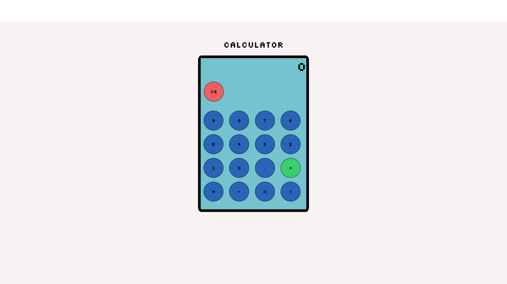

#   TODO APP

### Simple To Do app made with Vanilla JavaScript, HTML and CSS.

## Click here for application. 
[Calculator](https://ris345.github.io/calculator-app.github.io/)

## Summary
This is a calculator app made with Vanilla JS. It was a challenging project because I had to change my thinking and change my approach to a systematic way. But I loved every moment of it. 

## Author

### Rishav Dev Acharya - Full Stack Software Developer  [Linkedin](https://www.linkedin.com/in/rishav-acharya-0482051a7/)
