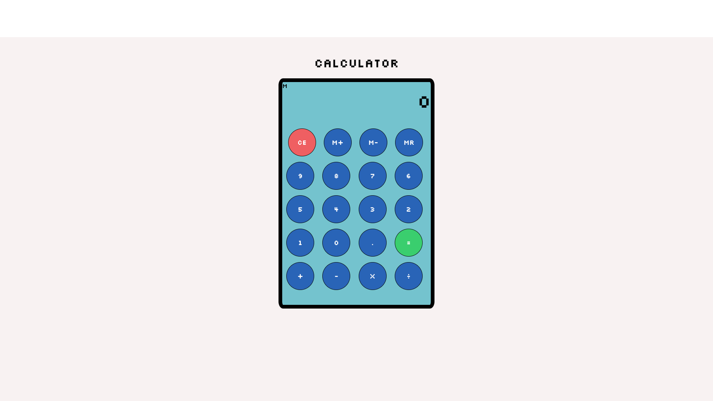

#   Calculator App 

### Simple Calculator app made with Vanilla JavaScript, HTML and CSS.

## Click here for application. 
[Calculator](https://ris345.github.io/calculator-app.github.io/)

## Summary
 Calculator app made with Vanilla JS,HTML and CSS. Calculator is a useful tool to have around -- Overall it was a challenging project, as I worked through this project I developed a deeper understanding of logic in programming. Completing this project has definitely changed my thinking and has helped me think more as a programmer. 

## Author

### Rishav Dev Acharya - Full Stack Software Developer  [Linkedin](https://www.linkedin.com/in/rishav-acharya-0482051a7/)

